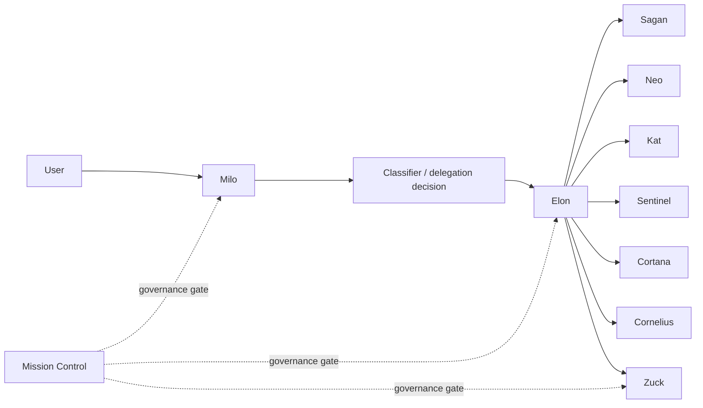

# OpenHermes

OpenHermes is the integration layer between a conversational front-door agent (Nous Hermes) and an orchestration core (OpenClaw), with governance via Mission Control.

## What This Is

OpenHermes is a two-layer multi-agent architecture.

At the top layer, a conversational agent manages intake, context, and delivery.

At the orchestration layer, a control agent routes work to specialist agents and applies governance before any sensitive or externally visible action proceeds.

The system is organized around three top-level agents:

- **Milo**: front-door agent responsible for user interaction, intake, and handoff.
- **Elon**: orchestration agent responsible for routing, coordination, and control logic.
- **Zuck**: publishing agent responsible for preparing approved outbound publication artifacts.

The specialist roster is intentionally narrow and role-scoped:

- **Sagan**: research
- **Neo**: engineering
- **Kat**: writing
- **Sentinel**: quality
- **Cortana**: memory
- **Cornelius**: infrastructure

This repository documents the coordination layer around that system.

It does not expose deployment topology, provider selection, runtime addresses, or environment-specific operational details.

## Architecture

The architecture separates conversation, orchestration, specialist execution, and publication.

Mission Control sits across the flow as the governance gate.

High-level flow:

1. A user interacts with Milo.
2. Milo determines whether the request can be handled directly or should be delegated.
3. Elon coordinates specialist work when delegation is required.
4. Specialists return bounded outputs rather than acting independently.
5. Zuck handles publication-oriented outputs only after governance conditions are met.

This separation is deliberate.

Conversation, orchestration, specialist execution, and publication have different risk profiles and should not collapse into a single agent role.

## Design Goals

OpenHermes exists to make multi-agent coordination inspectable and governable.

Core goals:

- Preserve a clear boundary between front-door conversation and orchestration.
- Keep specialist roles narrow enough to reason about.
- Route externally visible actions through explicit governance.
- Maintain sanitized reference material suitable for a public repository.
- Support phased construction rather than a single opaque implementation drop.

## What's In This Repository

This repository contains reference and coordination assets for the system:

- Sanitized reference configuration examples
- Bridge schemas and interface contracts
- Governance policy templates
- Runbooks and architecture documents
- Build planning artifacts, including [`PLAN.md`](./PLAN.md)

The repo is intended to explain structure, interfaces, expectations, and build sequencing.

It is not intended to serve as a live runtime dump.

## What's Not In This Repository

The following classes of material are intentionally excluded:

- Secrets, API keys, and OAuth credentials
- Live memory or user data
- Audit trails or session transcripts
- Internal infrastructure identifiers such as hostnames, IP addresses, and usernames

Public reference material should help readers understand the system without creating reconnaissance value for an attacker.

## Repository Layout

The current scaffold is organized around a few stable areas:

- `agents/` for agent-facing role material
- `bridge/` for schemas, references, and integration contracts
- `docs/` for architecture, governance, naming, and runbooks
- `deploy/` for deployment-related templates and operational scaffolds
- `governance/` for policy, approvals, and audit-oriented structure
- `scripts/` for controlled migration and observability helpers
- `state/` for planning and decision continuity
- `workspace/` for sanitized workspace scaffolding

Specific file contents may change as the build proceeds, but the repository intent remains the same: public, reference-first, and sanitized.

## Operating Principles

Several principles shape how this repository is curated:

- Public artifacts should remain useful without exposing operational specifics.
- Governance is a first-class architectural concern, not an afterthought.
- Specialists should exchange bounded artifacts instead of unrestricted shared state.
- Publication is separated from orchestration to reduce accidental side effects.
- Memory and runtime data are treated as sensitive by default.

These principles matter as much as the file tree.

They explain why some useful internal material is intentionally absent from the public repository.

## Build Approach

The repository is being assembled in phases rather than published as a single monolith.

That phased approach keeps public scaffolding, governance, migration, and operational concerns separable.

It also makes review easier: each phase can be checked for scope, sanitization, and architectural consistency before the next phase begins.

## Project Status

This repository is a reference implementation and coordination space. The system is being built in phases; see [`PLAN.md`](./PLAN.md) for current progress. Pull requests are not accepted during the build phase.

The current emphasis is on establishing the public scaffold, documenting the architecture at a conceptual level, and preparing sanitized migration paths for later phases.

## Security

If you discover a security issue, please see [`SECURITY.md`](./SECURITY.md) for responsible disclosure.

## License

MIT. See [`LICENSE`](./LICENSE).
